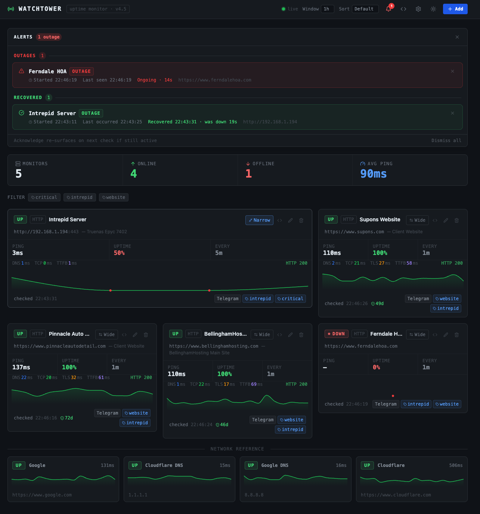
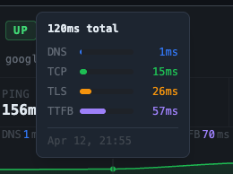
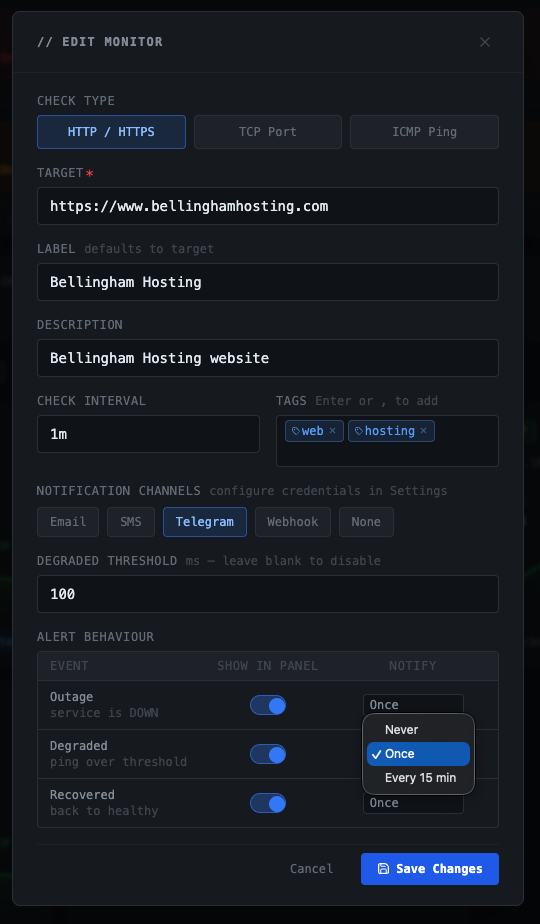
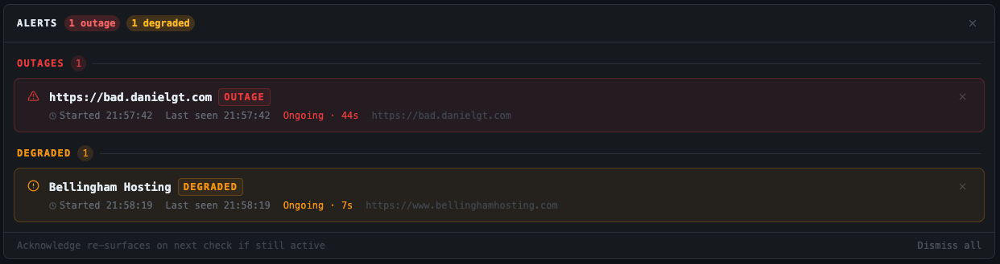
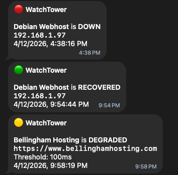

# WatchTower

**Self-hosted uptime monitoring for developers, homelabbers, and small teams.**

WatchTower makes real HTTP(S), TCP, and ICMP checks on configurable intervals, stores the results in SQLite, and pushes every result to the browser the instant it lands via Server-Sent Events. No polling, no page refreshes. When something goes down you know immediately - and when it comes back up, you know that too.

Run it on a Raspberry Pi, a home server, or a cheap VPS. It tracks public-facing APIs and websites just as well as internal services like a Plex server, a NAS, a database port, or a self-hosted app behind a reverse proxy.




---

## Features

### Monitoring
- **Four check types** - HTTP(S) with full timing breakdown, API with response/body validation, TCP port reachability, ICMP ping
- **Live dashboard** - cards update in real time via Server-Sent Events
- **Time-based history** - view 1h (raw), 12h, 1d, or 1w of history; sparklines and uptime % always match the selected window
- **Detailed HTTP timing** - DNS, TCP, TLS, and TTFB measured and displayed separately
- **SSL certificate monitoring** - days until expiry shown on every HTTPS monitor
- **Summary bar** - total monitors, online/offline count, and average ping at a glance
- **Network Reference strip** - Google, Cloudflare (1.1.1.1), Google DNS (8.8.8.8), and Cloudflare.com auto-seeded on first run so you can tell at a glance whether an outage is yours or theirs

### Organization
- **Tags** - freeform labels with autocomplete; filter the grid by one or more tags (OR logic)
- **Sorting** - by uptime (worst first), average ping (slowest first), or drag-to-reorder in default mode
- **Drag-to-reorder** - grab any card header and drag to rearrange; order persists across sessions
- **Resizable cards** - toggle any card between 1-column and 2-column width; persists across sessions
- **Compact reference cards** - reference monitors render in a smaller footprint so they don't crowd your real monitors

### Alerts
- **In-app alert panel** - bell icon surfaces active outages with a live elapsed-time counter; resolved alerts show total downtime; dismiss individually or all at once
- **Three alert levels** - Outage, Degraded (configurable ping threshold), and Recovered; each with independent panel visibility and notification frequency (once / every 15 min)
- **HTTP body validation** - optional plain-string check on the response body; treats a mismatch as DOWN even on a 2xx response
- **Telegram** - free push notifications via Telegram Bot API
- **Email** - SMTP delivery; works with Gmail App Passwords, Brevo, Resend, or any relay
- **SMS** - Twilio integration (~$0.008/message)
- **Test before saving** - send a test alert with your current form values without committing to save

### Settings
- **Tabbed settings panel** - centered modal with General and Notifications tabs
- **General tab** - dashboard-wide preferences including grouped vs flat view toggle
- **Filtered channels** - per-monitor alert picker only shows channels enabled in Settings; incomplete credentials block save with an error

### Embed
- **Per-monitor widget** - 360x230 iframe showing a single card with live updates
- **Full dashboard** - read-only iframe view of the entire dashboard; no edit, delete, or settings controls

### Other
- **Dark / Light theme** - toggle in the header; persists in localStorage
- **Persistent storage** - monitors, check history, and alert credentials all survive restarts (SQLite)
- **Docker Compose** - single service, named volume, ships ready to run

---

## Screenshots

### HTTP Performance Breakdown

Hover any sparkline bar to see the full HTTP timing breakdown - DNS, TCP, TLS, and TTFB rendered as proportional colored segments with millisecond labels. Aggregated windows (12h, 1d, 1w) show average ping and per-bucket uptime instead.



### Adding and Editing Monitors

Configure the target URL or IP, check type, interval, tags, and which alert channels fire for this monitor. Tag autocomplete suggests existing labels as you type.



### Alert Panel

The bell icon in the header shows a count of active outages. Click it to expand the panel, which separates ongoing outages from degraded monitors and shows a live elapsed-time counter for anything still down.



### Telegram Notifications

DOWN, RECOVERED, and DEGRADED events are sent immediately to your configured channels. No polling interval - alerts fire the moment the check result lands.



---

## Check Types

### HTTP / HTTPS

Sends a real HTTP or HTTPS request and measures the full request lifecycle.

**Best for:** public websites, REST APIs, reverse-proxied services, anything with a TLS certificate, third-party SaaS your app depends on.

**You get:** DNS ms, TCP ms, TLS ms, TTFB ms, HTTP status code, SSL expiry countdown.

### API

Sends an HTTP GET request and validates the response against configurable rules — status code, response body, or a specific JSON field value. Uses the same timing infrastructure as HTTP checks.

**Best for:** `/health` endpoints, JSON APIs where you care about the response payload not just reachability, services that return `200 OK` even when degraded.

**You get:** DNS ms, TCP ms, TLS ms, TTFB ms, HTTP status code, SSL expiry countdown, pass/fail for any configured body or JSON assertion.

**Auth options:** basic auth (username + password), bearer token, or custom headers (up to 5 key-value pairs).

> **Security note:** auth credentials are stored as plaintext in SQLite. Credential encryption is planned for a future release.

### TCP

Opens a raw TCP connection to a host and port. No application-layer data exchanged - success means the port accepted the connection.

**Best for:** databases (Postgres :5432, MySQL :3306, Redis :6379), mail servers, internal services not exposed via URL, verifying firewall rules and port-forwards.

**You get:** connection latency in ms.

### ICMP (Ping)

Sends an ICMP echo request. Measures raw round-trip latency with no concern for open ports or services.

**Best for:** bare-metal servers, network equipment (routers, switches, access points), NAS boxes, IoT devices, diagnosing latency vs availability.

> **Note:** ICMP requires the `NET_RAW` capability. The provided `docker-compose.yml` sets this automatically. Running outside Docker may require `sudo` or `CAP_NET_RAW` on the Node process.

**You get:** round-trip latency in ms.

---

## Getting Started

### Docker (recommended)

```bash
docker compose up --build
```

Open [http://localhost:3000](http://localhost:3000). Data is stored in a named volume (`watchtower-data`) and survives container restarts.

### Local development

```bash
# Terminal 1 - backend (Express on :3000)
cd server
npm install
npm run dev

# Terminal 2 - frontend (Vite on :5173, proxies /api to :3000)
npm install
npm run dev
```

Open [http://localhost:5173](http://localhost:5173).

```bash
# Production build - outputs to server/public/, served by Express
npm run build
```

---

## Alert Notifications

Open the Settings panel (gear icon in the header) to configure channels. Test any channel before saving - credentials in the form are sent with the test request.

### Telegram (free)

1. Message `@BotFather` on Telegram and create a bot to get a token
2. Message your bot, then open `https://api.telegram.org/bot<TOKEN>/getUpdates` to find your chat ID
3. Paste the token and chat ID into the Telegram section and enable the channel

### Email (SMTP)

| Field    | Example                          |
|----------|----------------------------------|
| Host     | `smtp.gmail.com`                 |
| Port     | `587` (STARTTLS) or `465` (SSL)  |
| Username | your email address               |
| Password | Gmail App Password or relay key  |
| From     | the sending address              |
| To       | where alerts should land         |

Gmail users: use an [App Password](https://support.google.com/accounts/answer/185833), not your account password.

### SMS via Twilio

Requires a Twilio account and a purchased phone number (~$0.008/message). Paste your Account SID, Auth Token, and both phone numbers in E.164 format (e.g. `+15551234567`).

---

## Embedding

Click the `<>` icon on any monitor card for a single-monitor widget, or click `<>` in the header for the full dashboard. Both tabs show a live URL preview and copyable iframe code.

```html
<!-- Single monitor widget -->
<iframe
  src="https://your-watchtower/embed/monitor/MONITOR_ID"
  width="360" height="230" frameborder="0"
  style="border-radius:8px;overflow:hidden"
></iframe>

<!-- Full read-only dashboard -->
<iframe
  src="https://your-watchtower/embed"
  width="100%" height="600" frameborder="0"
  style="border-radius:8px;overflow:hidden"
></iframe>
```

Embedded views receive live SSE updates and have no edit, delete, or settings controls.

---

## API Reference

| Method | Path                              | Description                                          |
|--------|-----------------------------------|------------------------------------------------------|
| GET    | `/api/monitors`                   | List all monitors with history (`?window=1h/12h/1d/1w`) |
| GET    | `/api/monitors/:id`               | Get a single monitor                                 |
| POST   | `/api/monitors`                   | Create a monitor                                     |
| PUT    | `/api/monitors/:id`               | Update a monitor                                     |
| DELETE | `/api/monitors/:id`               | Delete a monitor                                     |
| POST   | `/api/monitors/:id/check`         | Trigger an immediate check                           |
| GET    | `/api/events`                     | SSE stream of live check results                     |
| GET    | `/api/settings`                   | Get alert channel configuration                      |
| PUT    | `/api/settings`                   | Save alert channel configuration                     |
| POST   | `/api/settings/test/:channel`     | Send a test alert (`telegram`, `email`, `twilio`)    |

### Monitor schema

| Field         | Type                      | Description                                                        |
|---------------|---------------------------|--------------------------------------------------------------------|
| `target`      | string                    | IP address, hostname, or URL                                       |
| `label`       | string                    | Display name (defaults to target)                                  |
| `description` | string                    | Optional notes shown on the card                                   |
| `checkType`   | `http` / `api` / `tcp` / `icmp` | Check strategy                                               |
| `interval`    | number (seconds)          | How often to run checks (default: 60)                              |
| `port`        | number                    | Required for TCP checks                                            |
| `alertTypes`  | string[]                  | `Email`, `SMS`, `Telegram`, `Webhook`, or `None`                   |
| `tags`        | string[]                  | Freeform labels; `_ref` is reserved for built-in reference monitors |
| `expectedStatus` | number                 | API checks only — expected HTTP status code (default: 200)         |
| `bodyMatch`   | string                    | API/HTTP checks — plain string the response body must contain      |
| `jsonPath`    | string                    | API checks only — dot-notation path to a JSON field (e.g. `data.status`) |
| `jsonExpected`| string                    | API checks only — expected string value at `jsonPath`              |
| `authType`    | `none` / `basic` / `bearer` | API checks only — authentication method                          |
| `authUser`    | string                    | API checks — basic auth username                                   |
| `authPass`    | string                    | API checks — basic auth password (stored plaintext)               |
| `authToken`   | string                    | API checks — bearer token (stored plaintext)                      |
| `headers`     | `{key,value}[]`           | API checks — up to 5 custom request headers                       |

---

## Tech Stack

| Layer        | Library / Tool                       |
|--------------|--------------------------------------|
| UI           | React 18 (hooks + context)           |
| Styling      | Tailwind CSS (CDN play script)       |
| Charts       | recharts `AreaChart`                 |
| Icons        | lucide-react                         |
| Bundler      | Vite 5                               |
| Backend      | Node.js 20 + Express 4               |
| Database     | SQLite via better-sqlite3 (WAL mode) |
| HTTP checks  | got 13                               |
| Real-time    | Server-Sent Events (EventSource API) |
| Email alerts | nodemailer 8                         |
| SMS alerts   | Twilio REST API (via got)            |
| Chat alerts  | Telegram Bot API (via got)           |
| Container    | Docker + Docker Compose              |

---

## Project Structure

```
uptime-checker/
├── Dockerfile
├── docker-compose.yml
├── index.html
├── vite.config.js
├── images/                          # README screenshots
├── src/                             # React frontend
│   ├── main.jsx                     # Entry point - embed path detection, ThemeProvider
│   ├── App.jsx                      # Root layout, tag filter, alert tracking, seeding
│   ├── types/monitor.js             # Monitor schema + formatters
│   ├── hooks/
│   │   ├── useMonitors.js           # REST + SSE state layer
│   │   └── useTheme.jsx             # Dark/light theme context + token sets
│   └── components/
│       ├── SummaryBar.jsx           # Aggregate stats bar
│       ├── MonitorCard.jsx          # Monitor card, graphical tooltip, compact mode
│       ├── MonitorForm.jsx          # Add / Edit modal with tag autocomplete
│       ├── AlertsPanel.jsx          # Dismissable outage alert panel
│       ├── SettingsPanel.jsx        # Slide-out alert channel configuration
│       ├── EmbedModal.jsx           # iframe code generator (widget + full dashboard)
│       └── EmbedView.jsx            # Read-only routes (/embed, /embed/monitor/:id)
└── server/
    ├── package.json
    └── src/
        ├── server.js                # Express app + static serving
        ├── scheduler.js             # Per-monitor polling + alert state machine
        ├── alerter.js               # Telegram / Email / Twilio dispatch
        ├── sse.js                   # SSE broadcast to connected clients
        ├── db/index.js              # SQLite schema, migrations, settings helpers
        ├── checkers/
        │   ├── index.js             # Dispatcher
        │   ├── http.js              # HTTP check with timing breakdown
        │   ├── tcp.js               # TCP port reachability
        │   └── icmp.js              # ICMP ping (requires NET_RAW)
        └── routes/
            ├── monitors.js          # CRUD + manual trigger + windowed history
            └── settings.js          # Alert config + test endpoints
```

---

## Changelog

### v4.0.0

#### Card layout and sorting

- Cards can be manually reordered by dragging — grab anywhere in the card header and drop to rearrange; order persists in localStorage
- Cards are resizable between 1-column and 2-column widths via the **Wide / Narrow** button in the card header; persists in localStorage
- Resize is responsive: a 2-wide card stays 2 columns on wider viewports and collapses to full width on narrow ones
- Drag-to-reorder is active in Default sort mode; switching to Uptime or Ping sort disables drag handles

#### Settings panel

- Redesigned as a fixed-size centered modal with left-side vertical tab navigation
- **General tab** — dashboard-wide preferences including the grouped vs flat view toggle
- **Notifications tab** — Telegram, Email, and SMS channel configuration

### v4.1.0

#### Alert channel filtering

- The notification channel picker in the monitor form only shows channels that are toggled **enabled** in Settings
- Selecting an enabled channel that has incomplete credentials shows a warning indicator and blocks save with a clear error message — preventing silent alert failures

#### HTTP response body validation

- Optional "Body Contains" field on HTTP monitors — plain string, case-insensitive
- If set, the response body must contain the string or the check is treated as DOWN regardless of HTTP status code
- Response bodies over 256 KB are aborted and treated as a failed body check; the cap also protects the server from memory exhaustion on large API responses
- Body content is never stored — only the pass/fail result is recorded

### v4.1.1

#### Bug fixes

- Fixed an issue where all HTTP/HTTPS monitors reported DOWN after v4.1.0. The 256 KB response size cap was applied to every HTTP request, causing large responses to fail with an overflow error even when body validation was not configured.
- Modal windows (Add/Edit monitor, Settings, Embed) now scroll correctly when the browser viewport is shorter than the modal height.

### v4.2.0

#### New check type: API

A dedicated check type for REST and JSON API endpoints. HTTP checks are now reachability-only; body and response validation belong here.

- **Expected status code** — exact match (default: 200); the check is treated as DOWN if the response code differs
- **Body Contains** — optional plain-string, case-insensitive substring match on the response body
- **JSON assertion** — dot-notation field path (e.g. `data.status`) plus an expected value; DOWN if the field is missing or the value doesn't match
- **Authentication** — Basic Auth (username + password) or Bearer Token per monitor
- **Custom headers** — up to five arbitrary key-value header pairs (useful for `X-API-Key` and similar schemes)
- Full timing breakdown (DNS, TCP, TLS, TTFB) identical to HTTP checks
- Assertion failure reason shown directly on the card when a monitor is DOWN

> **Security note:** authentication credentials are stored as plaintext in SQLite alongside other monitor config. Credential encryption is planned for a future release.

#### Migration

Existing HTTP monitors with a "Body Contains" value are automatically migrated to the API check type on first run. All other settings are preserved.

### v4.2.1

#### Webhook alert channel

- New **Webhook** channel in the Notifications tab — paste any URL and WatchTower will POST a JSON payload on every alert event
- Payload includes `event` (`down` / `degraded` / `recovered`), monitor details (`id`, `label`, `target`, `checkType`, `tags`), and a UTC timestamp; compatible with Slack incoming webhooks, Discord, n8n, Zapier, Make, ntfy.sh, and any HTTP endpoint
- Behaves like all other channels: must be enabled in Settings before it appears in the monitor form, and save is blocked if the URL is missing

#### Bug fix

- Fixed Webhook appearing in the monitor notification channel picker even though it had no configuration UI and no implementation — selecting it previously fired nothing silently

---

## Roadmap

### v4.x - Module System

A plugin architecture that extends WatchTower beyond uptime monitoring. Modules render as cards in the same grid as monitors and follow the same visual language, but each module defines its own data fetching, display, and alert logic.

#### Module contract

Every module exposes a standard set of fields so the dashboard can render configuration forms and handle alerts consistently:

| Field          | Description                                                                 |
|----------------|-----------------------------------------------------------------------------|
| `label`        | Display name shown in the card header                                       |
| `description`  | Optional notes                                                              |
| `interval`     | How often the module fetches data; module defines the allowed range         |
| `tags`         | Freeform labels; works with the existing tag filter                         |
| `alertTypes`   | `Email`, `SMS`, `Telegram`, `Webhook`, `Notification`, or `None`            |
| `alertBehavior`| Module-defined thresholds that map to the standard down/degraded/recovered states, plus `Notification` for informational pushes that don't imply a failure |

The `Notification` alert type is a fourth alert state available to modules for events that are worth surfacing (e.g. "usage crossed 80% of monthly quota") without implying the monitored thing is down.

Module credentials are stored in the existing `settings` table under a namespaced prefix (`module.<id>.<key>`) and auto-render as a new section in the Settings panel.

#### Bundled modules

**Claude API Usage**
Polls the Anthropic API for token usage and cost data. Displays current period spend, token counts by model, and a usage trend sparkline. Fires a `Notification` alert when usage crosses a configurable threshold.

**Cloudflare Analytics**
Queries the Cloudflare GraphQL Analytics API (`api.cloudflare.com/client/v4/graphql`) for a configured zone. Displays requests, pageviews, unique visitors, and bandwidth for the selected time window. Requires a Cloudflare API token with `Analytics:Read` permission and a Zone ID. Supports the same 1h/12h/1d/1w history windows as monitors.

#### Tag groups

Tags become first-class objects on the dashboard. The default view collapses each tag into a single summary card rather than showing every monitor individually.

- **Tag summary cards** - each tag renders as one card showing the tag name, the names of its members, an aggregate status (worst status wins - one DOWN member makes the group DOWN), member count, and a combined uptime figure
- **Expand on click** - clicking a tag card or its label replaces it in the grid with all the individual member cards; clicking again collapses them back
- **Untagged items** - monitors and modules with no tags always appear individually and are not grouped
- **View toggle** - a setting in the configuration panel switches between grouped view (default) and flat view (all cards shown individually, current behavior); persists across sessions

#### Settings panel

- **Left-side tab navigation** — navigates between General, Notifications, and one tab per installed module that requires credentials
- **General tab** — dashboard-wide preferences including the grouped vs flat view toggle

---

## License

MIT
