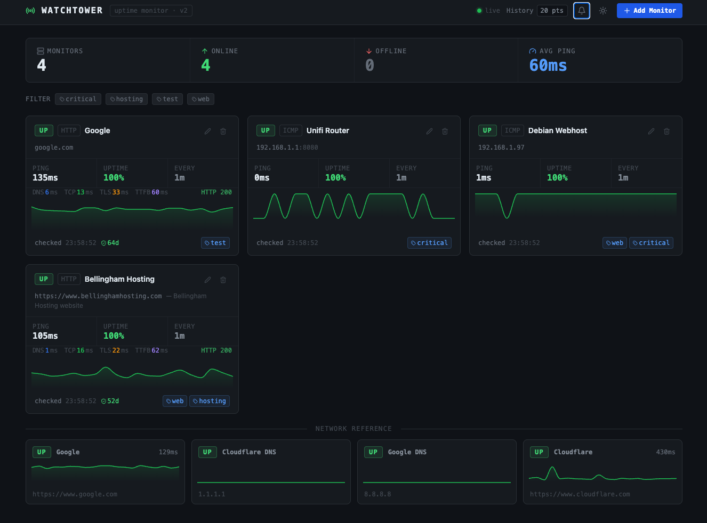

# WatchTower - Uptime Monitor

WatchTower is a self-hosted uptime monitoring dashboard built for developers, homelabbers, and small teams who want visibility into their infrastructure without the overhead of a full observability stack.

Run it on a Raspberry Pi, a home server, or a cheap VPS and get instant visibility into everything on your network - from public-facing APIs and websites to internal services like a Plex server, a NAS, a router, a local database port, or a self-hosted app behind a reverse proxy. It's equally at home tracking a handful of production services for a side project or watching dozens of hosts across a homelab.

Under the hood it makes real HTTP(S), TCP, and ICMP checks on configurable intervals and stores the results in SQLite. The browser connects via Server-Sent Events so every check result appears on screen the moment it lands - no page refresh, no polling. When a host goes down, an alert is raised immediately with a live elapsed-time counter; when it recovers, the alert is marked resolved with total downtime recorded. A built-in Network Reference strip (Google, Cloudflare, 8.8.8.8) runs alongside your monitors so you can tell at a glance whether an outage is on your end or theirs.

The whole stack ships as a single Docker Compose service - build, run, and forget. SQLite data is mounted on a named volume so check history survives container restarts.




## Features

- **Add monitors** - track any IP address or domain name
- **Three check types** - HTTP(S) with timing breakdown, TCP port reachability, ICMP ping
- **Real checks** - actual network requests, not simulated data
- **Live dashboard** - cards update in real time via Server-Sent Events (no polling)
- **Detailed timing** - DNS, TCP, TLS, and TTFB measured separately for HTTP checks
- **SSL certificate monitoring** - days until expiry shown on HTTPS monitors
- **Graphical sparkline tooltip** - hover shows DNS/TCP/TLS/TTFB as proportional colored bars with ms labels; aggregated windows show avg ping and per-bucket uptime
- **Time-based history window** - choose 1h (raw), 12h (15-min buckets), 1d (1-hour buckets), or 1w (6-hour buckets); the sparkline, uptime percentage, and tooltip all reflect the selected window; persists across sessions
- **Uptime percentage** - calculated from the selected history window so the number always matches what you are looking at
- **Summary bar** - total monitors, online/offline count, average ping across all hosts
- **Status badges** - UP (green), DOWN (red + pulse), PENDING (amber)
- **Sorting** - sort the monitor grid by uptime (worst first, to surface problems) or average ping (slowest first); default preserves creation order
- **Tag filtering** - filter the dashboard grid by one or more tags; multiple tags use OR logic
- **Tag autocomplete** - the tag input suggests existing tags as you type and lets you create new ones
- **Edit / Delete** - update any monitor config; changes take effect on the next check
- **Alerts panel** - bell icon shows active and resolved outage alerts; ongoing alerts display a live elapsed-time counter; dismissed individually or all at once; persists across reloads
- **Network Reference section** - Google, Cloudflare (1.1.1.1), Google DNS (8.8.8.8), and Cloudflare.com are auto-seeded on first run and shown in a compact strip at the bottom of the dashboard to help distinguish app-level failures from network-level ones
- **Alert notifications** - Telegram (free), Email via SMTP, and SMS via Twilio; configure credentials in the Settings panel; per-monitor alert type selection; test each channel before saving
- **Embeddable views** - embed any individual monitor as a 360x230 iframe widget, or embed the full read-only dashboard; copy the iframe code from the embed button on any card or in the header; embedded views receive live SSE updates and have no edit, delete, or settings controls
- **Dark / Light theme** - toggle with the sun/moon button in the header; preference persists in localStorage
- **Persistent storage** - all monitors, check history, and alert settings survive restarts (SQLite)

## Alert Notifications

Open the Settings panel (gear icon in the header) to configure alert channels. You can test each channel before saving - credentials are sent with the test request so you don't need to save first.

### Telegram (free)

1. Message `@BotFather` on Telegram and create a new bot to get a token
2. Message your bot, then open `https://api.telegram.org/bot<TOKEN>/getUpdates` to find your chat ID
3. Paste the token and chat ID into the Telegram section and enable the channel

### Email (SMTP)

Works with any SMTP relay - Gmail (use an App Password, not your account password), Brevo, Resend, or a self-hosted relay.

| Field | Example |
|-------|---------|
| SMTP Host | `smtp.gmail.com` |
| Port | `587` (STARTTLS) or `465` (SSL) |
| Username | your email address |
| Password | Gmail App Password or relay API key |
| From | the sending address |
| To | where alerts should land |

### SMS via Twilio (paid)

Requires a Twilio account and a purchased phone number (~$0.008/message).

Paste your Account SID, Auth Token, and both phone numbers (E.164 format, e.g. `+15551234567`) into the Twilio section.

## Embedding

Click the `<>` icon on any monitor card to get iframe code for that monitor widget, or click the `<>` button in the header for the full read-only dashboard.

```html
<!-- Single monitor widget (360x230) -->
<iframe
  src="https://your-watchtower-host/embed/monitor/MONITOR_ID"
  width="360"
  height="230"
  frameborder="0"
  style="border-radius:8px;overflow:hidden"
></iframe>

<!-- Full dashboard -->
<iframe
  src="https://your-watchtower-host/embed"
  width="100%"
  height="600"
  frameborder="0"
  style="border-radius:8px;overflow:hidden"
></iframe>
```

Embedded views receive live updates via SSE and have no edit, delete, or settings controls.

## Tech Stack

| Layer         | Library / Tool                        |
|---------------|---------------------------------------|
| UI            | React 18 (hooks + context)            |
| Styling       | Tailwind CSS (CDN play script)        |
| Charts        | recharts `AreaChart`                  |
| Icons         | lucide-react                          |
| Bundler       | Vite 5                                |
| Backend       | Node.js 20 + Express 4                |
| Database      | SQLite via better-sqlite3 (WAL mode)  |
| HTTP checks   | got 13                                |
| Real-time     | Server-Sent Events (EventSource API)  |
| Email alerts  | nodemailer 8                          |
| SMS alerts    | Twilio REST API (via got)             |
| Chat alerts   | Telegram Bot API (via got)            |
| Container     | Docker + Docker Compose               |

## Getting Started

### Docker (recommended)

**Prerequisites:** Docker + Docker Compose

```bash
docker compose up --build
```

Open [http://localhost:3000](http://localhost:3000). The SQLite database is stored in a named volume (`watchtower-data`) so data survives container restarts.

### Development (local)

**Prerequisites:** Node.js 20+

Run the backend and frontend separately in two terminals:

```bash
# Terminal 1 - backend (Express API on :3000)
cd server
npm install
npm run dev

# Terminal 2 - frontend dev server (Vite on :5173, proxies /api to :3000)
npm install
npm run dev
```

Open [http://localhost:5173](http://localhost:5173).

```bash
# Production build (outputs to server/public/, served by Express)
npm run build
```

## API

| Method | Path                          | Description                            |
|--------|-------------------------------|----------------------------------------|
| GET    | `/api/monitors`               | List all monitors with history         |
| GET    | `/api/monitors/:id`           | Get a single monitor                   |
| POST   | `/api/monitors`               | Create a monitor                       |
| PUT    | `/api/monitors/:id`           | Update a monitor                       |
| DELETE | `/api/monitors/:id`           | Delete a monitor                       |
| POST   | `/api/monitors/:id/check`     | Trigger an immediate check             |
| GET    | `/api/events`                 | SSE stream of check results            |
| GET    | `/api/settings`               | Get alert channel configuration        |
| PUT    | `/api/settings`               | Save alert channel configuration       |
| POST   | `/api/settings/test/:channel` | Send a test alert (`telegram`, `email`, `twilio`) |

### Monitor fields

| Field         | Type                  | Description                                      |
|---------------|-----------------------|--------------------------------------------------|
| `target`      | string                | IP address, hostname, or URL                     |
| `label`       | string                | Display name (defaults to target)                |
| `description` | string                | Optional notes                                   |
| `checkType`   | `http`\|`tcp`\|`icmp` | Check strategy                                   |
| `interval`    | number (seconds)      | How often to run checks (default: 60)            |
| `port`        | number                | Required for TCP checks                          |
| `alertTypes`  | string[]              | `Email`, `SMS`, `Telegram`, `Webhook`, or `None` |
| `tags`        | string[]              | Freeform grouping labels; `_ref` is reserved for built-in reference monitors |

## Project Structure

```
uptime-checker/
├── Dockerfile                       # Multi-stage build (frontend -> server deps -> runtime)
├── docker-compose.yml
├── index.html                       # Tailwind CDN, dark body background
├── vite.config.js
├── src/                             # React frontend
│   ├── main.jsx                     # Entry point, embed path detection, ThemeProvider
│   ├── App.jsx                      # Root layout, tag filter, alerts, reference seeding
│   ├── types/
│   │   └── monitor.js               # Monitor schema + formatters
│   ├── hooks/
│   │   ├── useMonitors.js           # REST + SSE state layer
│   │   └── useTheme.jsx             # Dark/light theme context + token sets
│   └── components/
│       ├── SummaryBar.jsx           # Aggregate stats bar
│       ├── MonitorCard.jsx          # Monitor card, graphical tooltip, compact mode
│       ├── MonitorForm.jsx          # Add / Edit modal with tag autocomplete
│       ├── AlertsPanel.jsx          # Dismissable outage alert panel
│       ├── SettingsPanel.jsx        # Slide-out alert channel configuration
│       ├── EmbedModal.jsx           # iframe code generator (widget + full dashboard)
│       └── EmbedView.jsx            # Read-only embed routes (/embed, /embed/monitor/:id)
└── server/                          # Node.js backend
    ├── package.json
    └── src/
        ├── server.js                # Express app + static serving
        ├── scheduler.js             # setInterval per monitor, alert state machine
        ├── alerter.js               # Telegram / Email / Twilio dispatch
        ├── sse.js                   # SSE broadcast to connected clients
        ├── db/
        │   └── index.js             # SQLite schema, migrations, settings helpers
        ├── checkers/
        │   ├── index.js             # Dispatcher (http / tcp / icmp)
        │   ├── http.js              # got-based HTTP check with timing breakdown
        │   ├── tcp.js               # TCP port reachability
        │   └── icmp.js              # ICMP ping (requires NET_RAW capability)
        └── routes/
            ├── monitors.js          # CRUD endpoints + manual trigger + windowed history
            └── settings.js          # Alert channel config + test endpoints
```

## License

MIT
